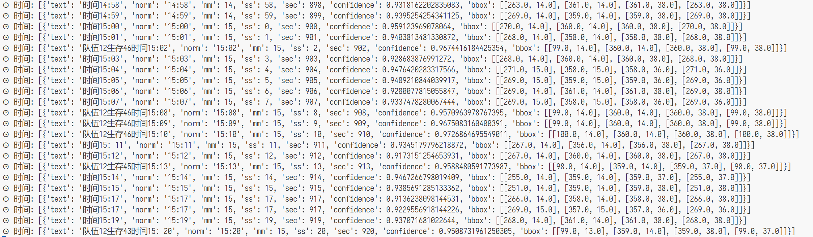
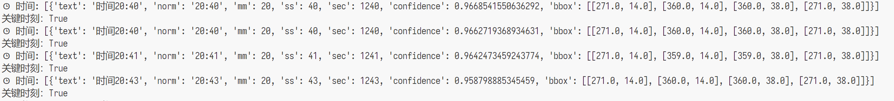

仅供个人学习使用，如下载，请24小时删除。如侵权，请联系我删除。

# 这是什么

一个纯满足个人需求的测试项目。
可以在命令行查看当前吃鸡直播间是否在重播/不重播时获取当前比赛时间。
因为有时候我只想看20分钟以后的【直播】。

# 用了什么以及怎么做到的

预设了固定的直播流 + ffmpeg + paddleocr 

前两个把直播弄成了一秒一张的图片，然后截取图片右上角丢给ocr。由于重播才会有“播”字，所以可以简单判断是否重播；
否则如果正在直播，右上角大概率就是时间（有时会因为导播缩放画面导致没时间）。

# 我的环境配置与运行流程

```
scoop install uv #安装uv
uv python install 3.11
uv venv --python 3.11 #创建虚拟环境
uv pip sync requirements.txt #依赖安装
uv run app/withffmpeg.py
```

如果不懂就去问 LLMs

# 截图

成功率98%的时间识别


设定>=20分钟为精彩瞬间
